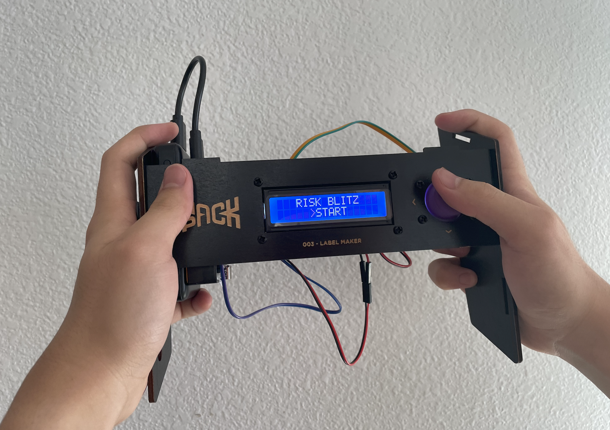
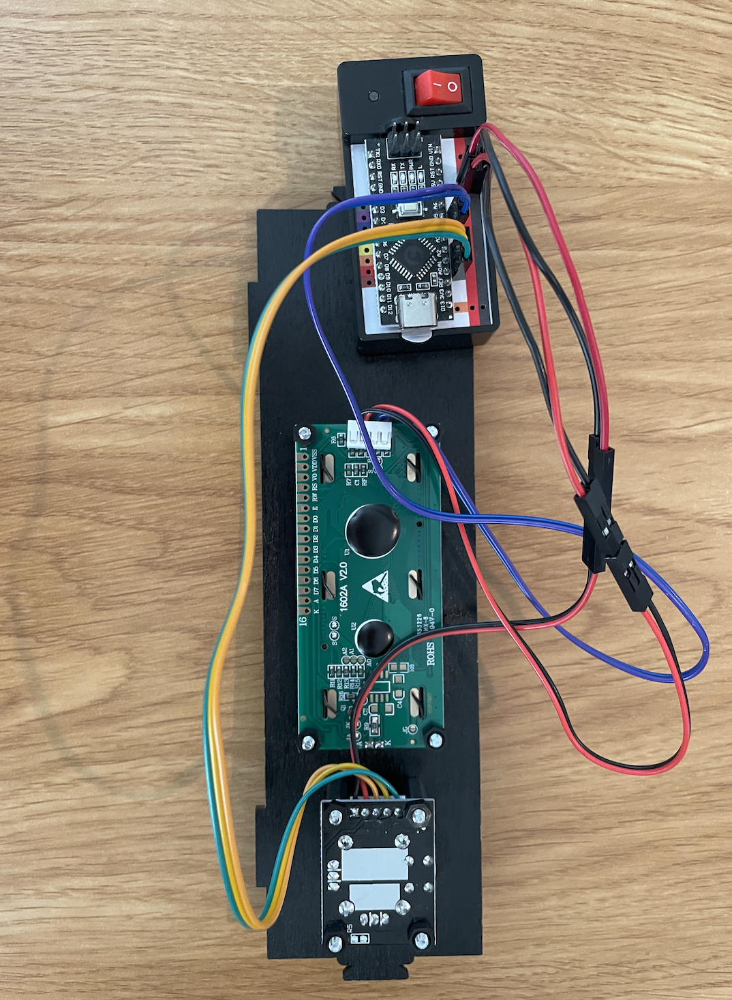
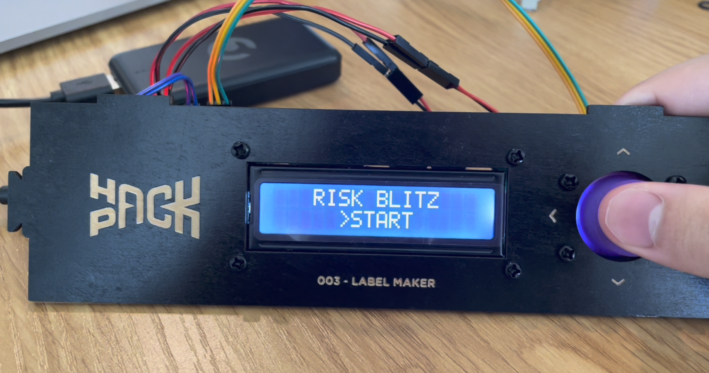
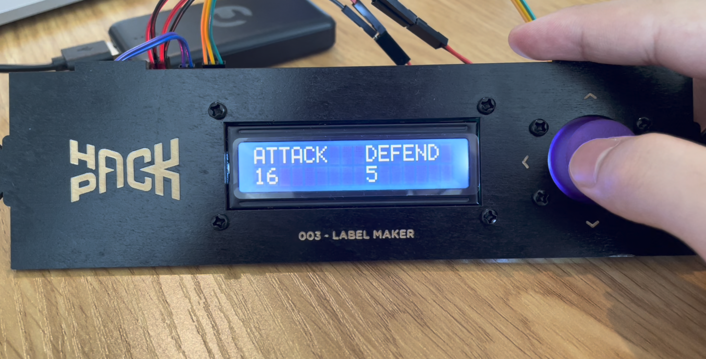
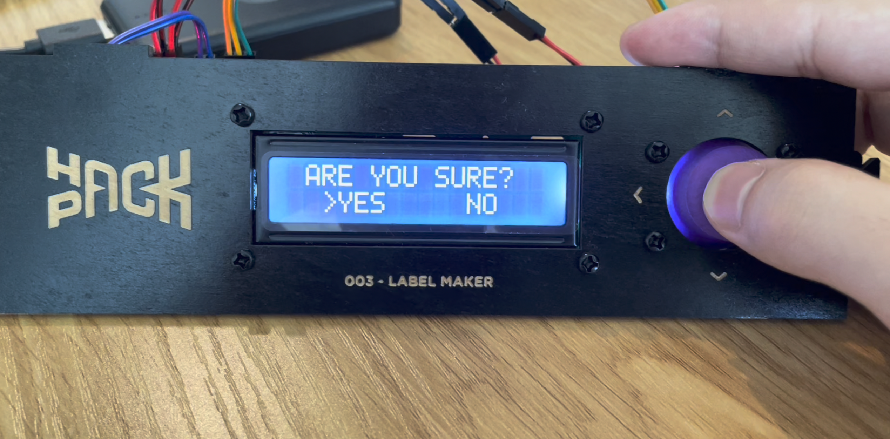
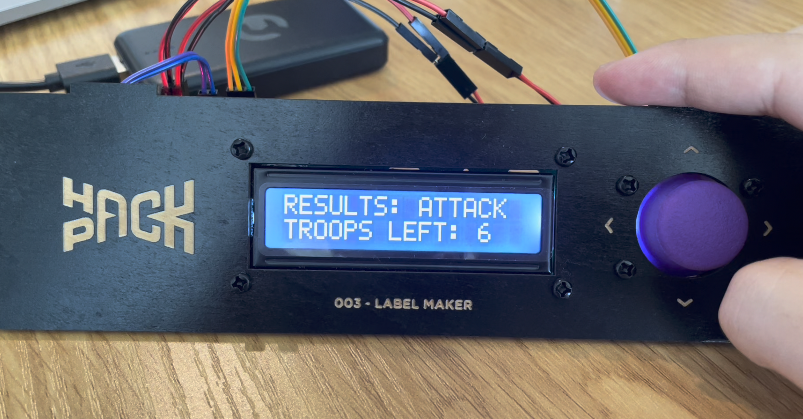

# Risk Blitz 🎲



Risk Blitz is an Arduino-based battle simulator for the board game **Risk**. It uses a joystick and 16x2 I2C LCD to let players enter the number of attacking and defending troops, simulate dice rolls, and display the battle results.

## Features

- 🎮 Joystick-controlled menu
- 🔢 Attacker and defender troop selection
- 🎲 Risk-style dice battle simulation
- 📺 16x2 I2C LCD interface
- 💻 Serial Monitor debugging
- ⚔️ Automatically resolves battles until one side is eliminated

## How It Works

The device uses a simple state machine:
```text
Main Menu
    ↓
Edit Attackers
    ↓
Edit Defenders
    ↓
Confirm Battle
    ↓
Simulate Battle
    ↓
Display Results
```

The attacker can roll up to three dice, while the defender can roll up to two. The dice are compared from highest to lowest, with the losing side losing troops. Battles continue until either the attacker or defender reaches zero troops.






## Hardware

- Arduino-compatible microcontroller
- 16x2 I2C LCD
- Analog joystick with push button
- Breadboard and jumper wires

## Pin Configuration

| Component | Arduino Pin |
|---|---|
| Joystick X | A2 |
| Joystick Y | A1 |
| Joystick Button | D14 |
| LCD SDA | SDA |
| LCD SCL | SCL |

## Software
The project is written in Arduino C++ and uses:
```cpp
#include <Wire.h>
#include <LiquidCrystal_I2C.h>
#include <ezButton.h>
```

The LCD uses I2C address 0x27:
```cpp
LiquidCrystal_I2C lcd(0x27, 16, 2);
```

## Credits & Attribution
This project was based on and adapted from the CrunchLabs Hack Pack Label Maker source code.

The original source code was created by CrunchLabs LLC, founded by Mark Rober, and is available through the official CrunchLabs Hack Pack repository:

https://github.com/HackPackOfficial/HackPack-Code

Risk Blitz modifies the original project by replacing the label-making functionality with a Risk battle simulator, including troop selection, dice mechanics, battle resolution, and a new LCD interface.

## Disclaimer
"Risk" is a trademark of its respective owner.

## License
The original CrunchLabs source code used in this project is licensed under the MIT License.

Copyright © 2025 CrunchLabs LLC (LabelMaker Code).

Original source code and attribution are retained in accordance with the MIT License.
